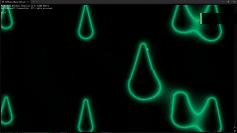
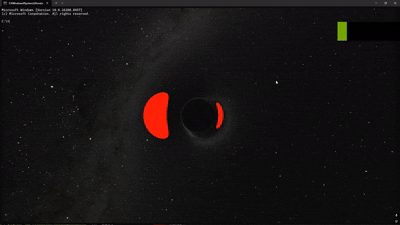

# 何ということでしょう！windowsのターミナルの画面をHLSLでいじることができます！
* [ps1.hlsl](/terminal/ps1.hlsl) - 水滴が落ちてくるアニメーション<br>
  
* [ps2.hlsl](/terminal/ps2.hlsl) - ブラックホールの周りを回るアニメーション<br>
  <br>
  [背景の画像](https://svs.gsfc.nasa.gov/4851/)はNASAの天の川銀河のskyMapを使用しています。<br>
  (NASAありがとう⸜(*ˊᵕˋ*)⸝‬ｱﾘｶﾞﾄｳ♡)<br>
また、NvidiaのGPUとIntelの内蔵GPUでしか試してないのでそれ以外のGPUで動かない可能性があります。<br>
* 設定でアクリル素材を有効にするとモダンになります。
# PSを適用するには
ターミナルにて設定->JSONファイルを開く、で設定ファイルを開きprofilesの中のdefaultなどに、
```
"experimental.pixelShaderPath": "psのファイルのパス"
```
を入れてください。詳しくは[Microsoftのサイト](https://learn.microsoft.com/en-us/windows/terminal/samples )で確認してください。
追加でexperimental.pixelShaderImagePathで画像のパスを設定しないといけません。
# Credits

Background sky texture based on imagery from NASA Scientific Visualization Studio:
https://svs.gsfc.nasa.gov/4851/
# ライセンス(守らなくても怒らないけど守ってね)
[MITライセンス](LICENSE)
